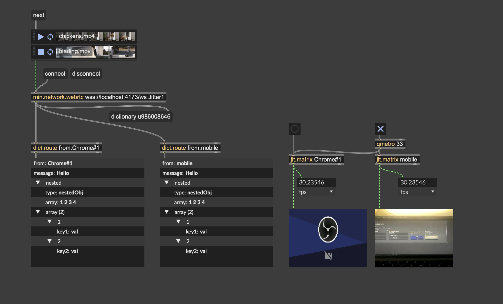

# min.network.webrtc

This package enables WebRTC video (and future audio) communication between Max and browsers, using modern C++ (Min-API) and a React/Websocket frontend.



## Video Send/Receive Flow

### Max → Browser

Max (matrix) → ARGBtoI420(libav sws_scale in CPU) → Encoder (libav videotoolbox in GPU) → WebRTC RTP → Browser

---

### Browser → Max

Browser (cam) → WebRTC RTP → Decoder (libav videotoolbox in GPU) → I420toARGB(libav sws_scale in CPU) → Matrix → Max

---

## Building the C++ External

Only ARM64 (Apple Silicon) is supported at present, as development is done on my Mac m1 pro.

---

## Frontend (JavaScript)

The frontend is located in `javascripts/socket-server-with-web`.

**Setup:**

```sh
cd javascripts/socket-server-with-web
npm install
npm run dev
# http://localhost:5173
# wsaddres `ws://localhost:5173/ws`

# or with self sign cert
npm run build
npm run preview
# https://localhost:4173
# wsaddres `wss://localhost:5173/ws`

# then can use another device to access the web
# browser https://192.168.x.x:4173
# wss://192.168.x.x:4173/ws
```